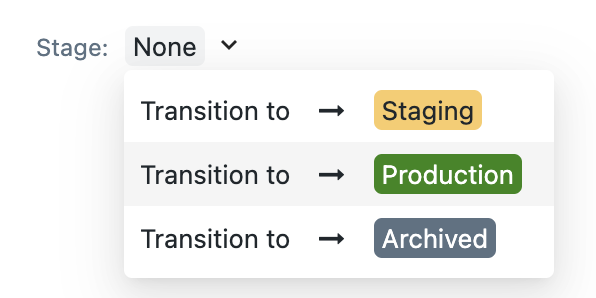
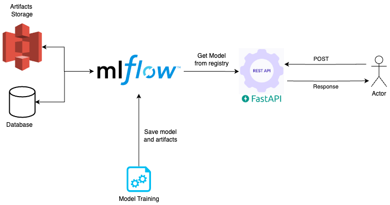

## Environment Setup Instructions
### Exploratory Data Analysis (EDA)
This section provides instructions on how to set up the environment for Exploratory Data Analysis (EDA) in this project. To install the required packages for EDA, run the following command:

1. Create a virtual enviroment and activate it:
    ```bash
    python -m venv .venv
    source .venv/bin/activate
    ```

2. **Installing Required Packages**: Run the following command to install the necessary packages for EDA:
    ```bash
    pip install ".[dev]"
    ```

3. Opening Jupyter Notebook: Launch the Jupyter notebook by running:

    ```bash
    jupyter lab EDA/challenge.ipynb
    ```

### Model Training and Deployment Setup
This project leverages [mlflow](https://mlflow.org/) as a comprehensive tool for model development, experimentation, and model registry. By integrating mlflow within a Docker Compose setup, this project accurately simulates a production environment. The training and server stages are seamlessly incorporated into this setup, creating a unified and efficient development-to-deployment workflow.

### 1. Setting Up MLflow with Object Storage Service and Database

Configure mlflow with an object storage service and a database by executing:

```bash
make mlflow
```

Optionally, you can run the command in detached mode by adding `detached=true`:

```bash
make mlflow detached=true
```

### 2. Running the Training Step
Initiate the training process by executing:
```bash
make train
```
After finish the training step,promote the model to production to make serving possible. Enter this [link](http://localhost:5000/#/models/BreastCancerModel/versions/1), go to `stage` and choose `Production`:




#### 3. Serving the Model from the Model Registry
After promoting the model to production, serve it by executing:


```bash
make api
```

#### 4. Terminating Docker Containers

To stop and remove all the Docker containers associated with this setup, run:

```bash
make down
```


**PS**: If you want test the train outside docker you need set:
```bash
export MLFLOW_TRACKING_URI=http://localhost:5000
export MLFLOW_S3_ENDPOINT_URL=http://localhost:9000
export AWS_ACCESS_KEY_ID=minio
export AWS_SECRET_ACCESS_KEY=minio123
```

# Deployment Archicture


The diagram above illustrates the general system architecture. MLflow serves as both our experimentation platform and model registry. The model is served using the FastAPI framework, which retrieves the model set in the MLflow model registry at the production stage.
